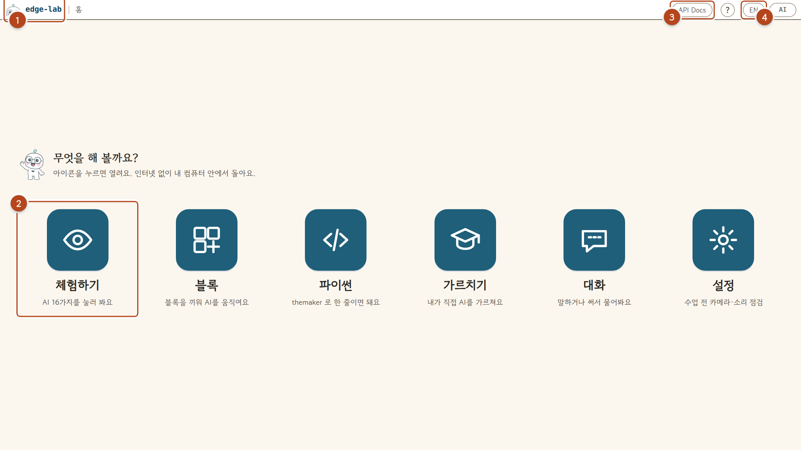
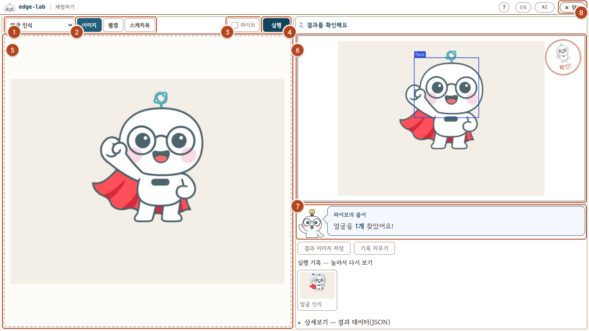
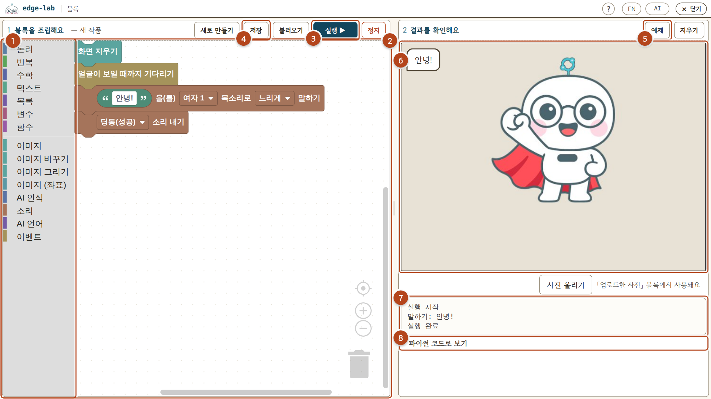
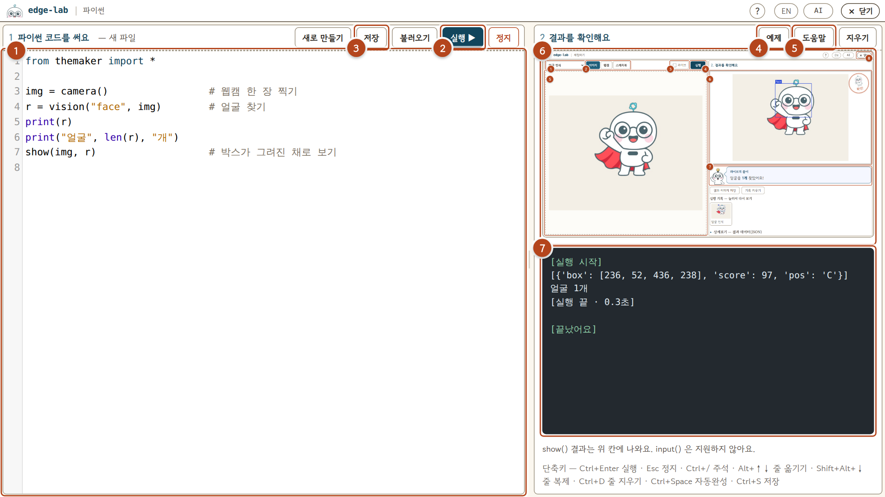
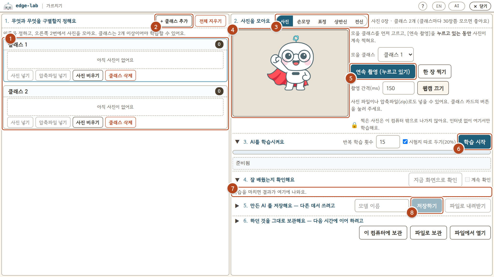
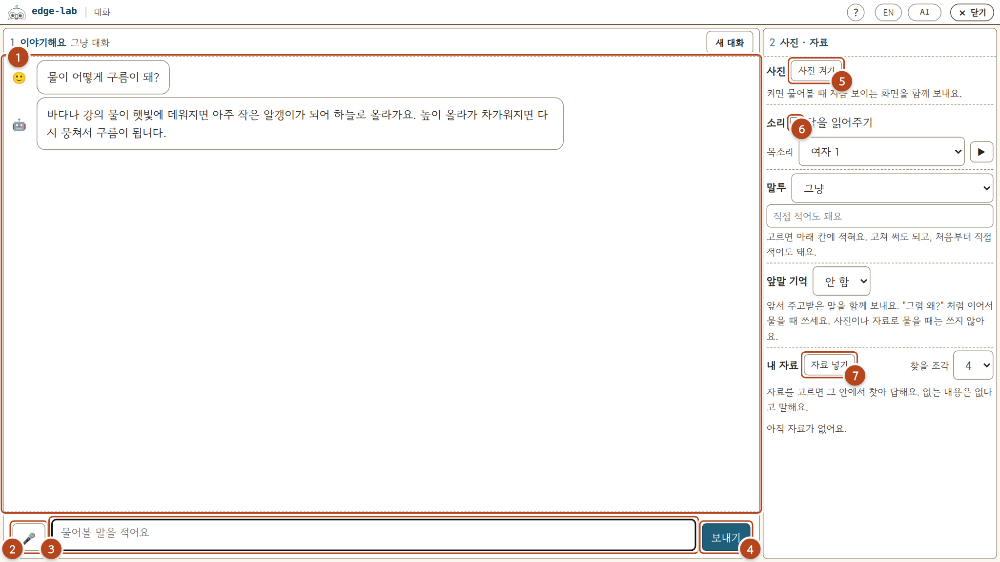
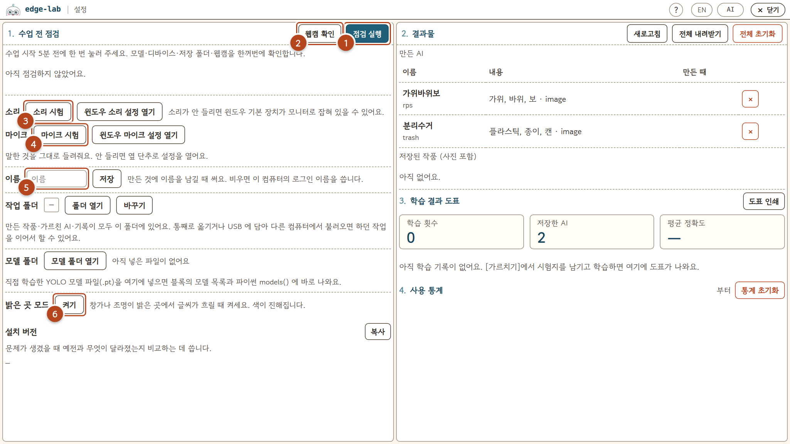

# edge-lab 사용 설명서

**한국어** · [English](#edge-lab-user-guide)

화면마다 **번호가 붙은 자리**가 무엇을 하는 곳인지만 적었습니다.

시작 — 바탕화면의 `edge-lab` 또는 `run.bat` 을 더블클릭하면 브라우저가 열립니다.
처음 켤 때는 AI를 올리느라 1~2분 걸립니다.

---

## 홈



| | |
|---|---|
| **1** | 어디서든 눌러 홈으로 |
| **2** | 앱 아이콘 — 누르면 열려요 (체험하기 · 블록 · 파이썬 · 가르치기 · 대화 · 설정) |
| **3** | API 문서 (선생님용) |
| **4** | 한국어 ↔ English |

---

## 체험하기 — AI 16가지를 눌러 봐요



| | |
|---|---|
| **1** | 어떤 AI로 알아볼지 고르기 (얼굴 · 사물 · 손 · 글자 · 사진 바꾸기 …) |
| **2** | 사진을 어디서 가져올지 — 이미지 파일 / 웹캠 / 스케치북 |
| **3** | 라이브 — 켜면 웹캠을 보며 계속 알아봐요 |
| **4** | **실행** — 스페이스바로도 돼요 |
| **5** | 사진을 넣는 칸 (끌어놓기 또는 클릭) |
| **6** | 결과 — 찾은 것에 박스가 그려져요 |
| **7** | 파이보의 풀이 — 결과를 말로 설명해 줘요 |
| **8** | 닫기 — 홈으로 돌아가요 |

---

## 블록 — 블록을 끼워 AI를 움직여요



| | |
|---|---|
| **1** | 블록 서랍 — 이미지 · AI 인식 · 소리 · AI 언어 · 이벤트 … |
| **2** | 블록을 끌어다 끼우는 곳 |
| **3** | **실행 ▶** / 정지 |
| **4** | 저장 · 불러오기 — 만든 작품은 `문서\Edge Lab\blocks` 에 |
| **5** | 예제 — 만들어진 블록을 불러와 바로 돌려 봐요 |
| **6** | 무대 — 찍은 사진과 결과가 여기 나와요 |
| **7** | 진행 기록 — 무엇을 하고 있는지 한 줄씩 |
| **8** | 파이썬 코드로 보기 — 내 블록이 파이썬으로 어떻게 되는지 |

> 카메라는 「사진 찍기」 블록이 돌 때만 켜지고, 실행이 끝나면 꺼집니다.

---

## 파이썬 — 한 줄이면 돼요



| | |
|---|---|
| **1** | 코드를 쓰는 곳 — 자동완성은 `Ctrl+Space` |
| **2** | **실행 ▶** (`Ctrl+Enter`) / 정지 (`Esc`) |
| **3** | 저장 · 불러오기 — `문서\Edge Lab\pycode` 에 |
| **4** | 예제 16종 |
| **5** | 도움말 — 쓸 수 있는 명령 목록 |
| **6** | `show()` 로 보낸 그림 |
| **7** | `print()` 출력 |

```python
from themaker import *

img = camera()                 # 웹캠 한 장 찍기
r = vision("face", img)        # 얼굴 찾기
print("얼굴", len(r), "개")
show(img, r)                   # 박스가 그려진 채로 보기
```

---

## 가르치기 — 내가 직접 AI를 가르쳐요



| | |
|---|---|
| **1** | 구별할 종류(클래스) — 예: 가위 · 바위 · 보 |
| **2** | 클래스 추가 — 2개 이상이어야 학습할 수 있어요 |
| **3** | 무엇으로 배울지 — 사진 · 손모양 · 표정 · 상반신 · 전신 |
| **4** | 웹캠 화면 ([웹캠 켜기] 를 눌러야 켜져요) |
| **5** | **연속 촬영** — 누르고 있는 동안 계속 찍혀요 (클래스마다 30장쯤) |
| **6** | **학습 시작** |
| **7** | 결과 — 정확도 · 학습 곡선 · 틀린 사진 |
| **8** | 저장 — 체험하기 · 블록 · 파이썬에서 불러 쓸 수 있어요 |

---

## 대화 — 말하거나 써서 물어봐요



| | |
|---|---|
| **1** | 주고받은 이야기 |
| **2** | 마이크 — 눌러서 말하기 |
| **3** | 글로 물어보기 |
| **4** | 보내기 |
| **5** | 사진 켜기 — 지금 보이는 화면을 함께 보내요 |
| **6** | 답을 읽어주기 — 목소리와 말투를 고를 수 있어요 |
| **7** | 자료 넣기 — 넣어 둔 자료 안에서 찾아 답해요 |

---

## 설정 — 수업 전 점검



| | |
|---|---|
| **1** | 점검 실행 — 모델 · 장치 · 저장 폴더를 한 번에 |
| **2** | 웹캠 확인 |
| **3** | 소리 시험 |
| **4** | 마이크 시험 — 3초 녹음해 그대로 들려줘요 |
| **5** | 이름 — 결과물에 함께 남아요 |
| **6** | 또렷하게 보기 — 밝은 교실에서 화면이 잘 안 보일 때 |

---

## 만든 것은 어디에

`문서\Edge Lab` — 프로그램을 새 버전으로 덮어써도 사라지지 않습니다.

| 폴더 | 들어 있는 것 |
|---|---|
| `user` | 가르친 AI |
| `blocks` · `pycode` | 블록 · 파이썬 작품 |
| `db` | 대화에 넣은 자료 |
| `stats` | 사용 기록 · 학습 결과 |

USB로 옮기려면 이 폴더를 통째로 복사하고, 다른 PC에서 설정의 **[바꾸기]** 로 그 폴더를 고릅니다.

---

## 잘 안 될 때

| 증상 | 해 볼 것 |
|---|---|
| 카메라가 안 켜져요 | 주소창 왼쪽 자물쇠·카메라 아이콘 → **허용**. 화상회의 앱이 쓰고 있으면 닫기 |
| 소리가 안 나요 | 설정 → **소리 시험**. 안 들리면 **윈도우 소리 설정 열기** 에서 기본 장치 확인 |
| 화면이 눈부셔요 | 설정 → **또렷하게 보기** |
| 다시 안내를 보고 싶어요 | 오른쪽 위 **?** |

**웹캠은 없어도 됩니다** — 사진을 올려서 하면 됩니다.

---
---

<a name="edge-lab-user-guide"></a>

# edge-lab User Guide

[한국어](#edge-lab-사용-설명서) · **English**

Each screen is marked with **numbers**, and each number says what that spot does. That's all.

To start — double-click `edge-lab` on the desktop, or `run.bat`. The browser opens by itself.
The first launch takes 1-2 minutes while the AI loads.

---

## Home


| | |
|---|---|
| **1** | Press from anywhere to go Home |
| **2** | App icons — press to open (Try it · Blocks · Python · Train · Talk · Settings) |
| **3** | API docs (for teachers) |
| **4** | Korean ↔ English |

---

## Try it — 16 kinds of AI, one press away


| | |
|---|---|
| **1** | Pick which AI to use (face · objects · hands · text · change the photo …) |
| **2** | Where the photo comes from — image file / webcam / sketchpad |
| **3** | Live — keeps recognizing straight from the webcam |
| **4** | **Run** — the spacebar works too |
| **5** | Drop a photo here (drag & drop, or click) |
| **6** | Result — boxes are drawn on what it found |
| **7** | Pibo says — explains the result in words |
| **8** | Close — back to Home |

---

## Blocks — snap blocks together to run the AI


| | |
|---|---|
| **1** | Block drawer — image · AI recognition · sound · AI language · events … |
| **2** | Drag blocks here and snap them together |
| **3** | **Run ▶** / Stop |
| **4** | Save · Load — your work goes to `Documents\Edge Lab\blocks` |
| **5** | Examples — load a ready-made program and run it |
| **6** | Stage — the photo taken and the result show here |
| **7** | Progress log — one line at a time |
| **8** | See as Python code — what your blocks become |

> The camera turns on only while the "take a photo" block runs, and turns off when the run ends.

---

## Python — one line is enough


| | |
|---|---|
| **1** | Where you write code — autocomplete is `Ctrl+Space` |
| **2** | **Run ▶** (`Ctrl+Enter`) / Stop (`Esc`) |
| **3** | Save · Load — to `Documents\Edge Lab\pycode` |
| **4** | 16 examples |
| **5** | Help — the commands you can use |
| **6** | The picture sent by `show()` |
| **7** | `print()` output |

```python
from themaker import *

img = camera()                 # one shot from the webcam
r = vision("face", img)        # find faces
print("faces:", len(r))
show(img, r)                   # see it with boxes drawn
```

---

## Train — teach an AI yourself


| | |
|---|---|
| **1** | The classes to tell apart — e.g. rock · paper · scissors |
| **2** | Add a class — you need at least 2 to train |
| **3** | What it learns from — photo · hand shape · expression · upper body · full body |
| **4** | Webcam view (press [Webcam on] to start it) |
| **5** | **Burst capture** — keeps shooting while held down (about 30 per class) |
| **6** | **Start training** |
| **7** | Results — accuracy · learning curve · the ones it got wrong |
| **8** | Save — then use it from Try it, Blocks and Python |

---

## Talk — ask by voice or text


| | |
|---|---|
| **1** | The conversation so far |
| **2** | Mic — press and speak |
| **3** | Type your question |
| **4** | Send |
| **5** | Camera on — sends what it sees along with your question |
| **6** | Read aloud — pick the voice and the tone |
| **7** | Add notes — it answers from inside what you added |

---

## Settings — check before class


| | |
|---|---|
| **1** | Run check — models · devices · save folder, all at once |
| **2** | Check webcam |
| **3** | Sound test |
| **4** | Mic test — records 3 seconds and plays it straight back |
| **5** | Name — stays with your work |
| **6** | High contrast — when the screen is hard to read in a bright room |

---

## Where your work goes

`Documents\Edge Lab` — it survives even when the program is overwritten with a new version.

| Folder | What's in it |
|---|---|
| `user` | AI you trained |
| `blocks` · `pycode` | Block and Python projects |
| `db` | Notes added in Talk |
| `stats` | Usage records · training results |

To move it to a USB stick, copy the whole folder, then on another PC use **[Change]** in Settings to point at it.

---

## When something doesn't work

| Symptom | Try this |
|---|---|
| The camera won't turn on | Lock/camera icon left of the address bar → **Allow**. Close video-call apps that may be using it |
| No sound | Settings → **Sound test**. If still silent, **Open Windows sound settings** and check the default device |
| The screen is too bright | Settings → **High contrast** |
| I want the walkthrough again | **?** at the top right |

**You do not need a webcam** — just upload a photo instead.
